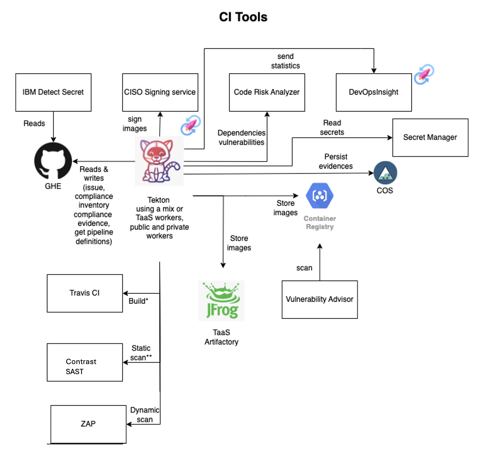

# CI Infrastrcuture
 
The diagram below describes the main components of the CI infrastrcucture.

Notes:

- \* Travis CI is used to build artifacts when multi arch support is needed (e.g. x86, arm and z); it is also used as part of the hostos pipelines

- \*\* Contrast SAST is used to execute static scan for all languages

- Dynamic scan has not yet been implemented.

## Install location

The private workers are running on two IKS clusters, running 30 nodes each:

- tekton-lon04-m3c.8x64 crn:v1:bluemix:public:containers-kubernetes:eu-gb:a/ed2dc269480f4b2ebe9d6c90e01d9099:cfurn1dl0diob85a3nl0:: This one has 15 nodes with flavour 16\*128 and 15 nodes with flavour 8\*64
- tekton-tor01-m3c.16x128 crn:v1:bluemix:public:containers-kubernetes:us-east:a/ed2dc269480f4b2ebe9d6c90e01d9099:cianr93w0sjo00sko3k0:: This one has 30 nodes with flavour 16\*128

Secret Manager: VPC-CI-SecretsManager crn:v1:bluemix:public:secrets-manager:eu-gb:a/ed2dc269480f4b2ebe9d6c90e01d9099:42095640-ac78-4777-bc21-53b5c72b2bef:: 

COS: VPC-CI-COS crn:v1:bluemix:public:cloud-object-storage:global:a/ed2dc269480f4b2ebe9d6c90e01d9099:8f068231-b721-4e94-93a3-ff646763c896::

Continous Delivery: crn:v1:bluemix:public:continuous-delivery:eu-gb:a/ed2dc269480f4b2ebe9d6c90e01d9099:82a8fa8c-22b9-4b36-b525-3e63ca2b17ba::

Container Registry:
- genctl-cicd crn:v1:bluemix:public:container-registry:ca-tor:a/ed2dc269480f4b2ebe9d6c90e01d9099::namespace:genctl-cicd
- genctl-cicd-onepipeline crn:v1:bluemix:public:container-registry:us-south:a/ed2dc269480f4b2ebe9d6c90e01d9099::namespace:genctl-cicd-onepipeline

SysDig: crn:v1:bluemix:public:sysdig-monitor:ca-tor:a/ed2dc269480f4b2ebe9d6c90e01d9099:5880b2ea-0ae2-4217-991a-c1d9fcd70eda::

All toolchain instances are created in London (eu-gb)

## Resource groups

Five resource groups:
- Default: not used
- Tekton_Workers: this is where the kube clusters, COS, Secret Manager and Container Registry reside
- One_Pipeline_Services: this is where all toolchain instances reside
- One_Pipeline_Dev: this is where test pipelines are spinned for testing purposes by teh CI team
- vault-secrets: This is dedicated to vault team for SM provisioning 
- Virtual Env: This the resource group dedicated to the process of re-architecting the front end way VEs are being accessed.

## Access Groups

Accesses to OnePipeLine Account are managed via AccessHub.

### One_Pipeline_Services_Operator

This access group is used by VPC developers.

Accesses granted:
- Secrets Manager: Tekton_Workers resource group, Viewer
- One_Pipeline_Services: resource group only, Viewer
- Tekton_Workers: resource group only, Viewer
- Toolchain: One_Pipeline_Services resource group, Viewer, PipelineRunner

### ImageScan

This access group is used only by the security team to continously scan images with Vulnerability Advisor.

Accesses granted:
- Container Registry: One_Pipeline_Services resource group, Reader, Viewer
- One_Pipeline_Services: resource group only, Viewer

### One_Pipeline_Developers

This access group is used by the CI developers for development purposes.

Accesses granted:
- Secrets Manager: One_Pipeline_Dev resource group, Reader, Viewer, Writer, Operator, Editor, Manager, SecretsReader, Administrator
- One_Pipeline_Services: resource group only, Viewer
- Toolchain: One_Pipeline_Dev resource group, Viewer, Editor, Operator, Administrator

### One_Pipeline_Users

This access group is used by the CI developers to manage production toolchains and one pipeline infrastructure.

Accesses granted:
- Container Registry: all resources, Reader, Viewer, Writer, Manager
- One_Pipeline_Services: resource group only, Viewer
- Support Center: all resources, Editor
- All Identity and Access Enabled services: One_Pipeline_Services resource group, Writer, Reader, Viewer, Editor, Operator

### Tekton_Worker_Admin

This access group is used only by automation. CI developers should become part of it only in case of emergency.

Accesses granted:
- Container Registry: Tekton_Workers resource group,Administrator, Manager, Editor
- All Identity and Access Enabled services: Tekton_Workers resource group, Administrator, Editor, Operator, Reader, Writer, Manager
- IBM Cloud Activity Tracker: Tekton_Workers resource group, Administrator, Editor, Viewer, Operator, Manager, Reader
- Secrets Manager: Tekton_Workers resource group, Reader, Writer, Viewer, Operator, Editor
- Kubernetes service: Tekton_Workers resource group, Reader, Writer, Manager, Viewer, Operator, Editor, Administrator
- Tekton_Workers: resource group only, Viewer, Operator, Editor, Administrator

### Tekton_Workers_Operator
   
This access group is used by CI developers to perform operation activities.

Accesses granted:
- All Identity and Access Enabled services: Tekton_Workers resource group, Reader, Viewer
- Secrets Manager: Tekton_Workers resource group, Reader, Viewer, Operator, SecretsReader
- Tekton_Workers: resource group only, Viewer
- IBM Cloud Monitoring: Tekton_Workers resource group, Editor, Writer

### Vault_Secrets
   
This access group is dedicated to Alex Stundzia to perform Vault related activities.

Accesses granted:
- IAM Access Management Service: vault_secrets resource group,Administrator, Key Manager
- All Identity and Access enabled services: vault_secrets resource group,Key Manager, Administrator, Key Manager
- Secrets Manager: vault_secrets resource group, Manager, SecretsReader, Administrator, Key Manager

### VE_Setup
   
This access group is dedicated to VE team to perform VSI related activities. 

Accesses granted:
- VPC Infrastructure Services: Virtual Env resource group,Administrator, Manager, Writer
 

