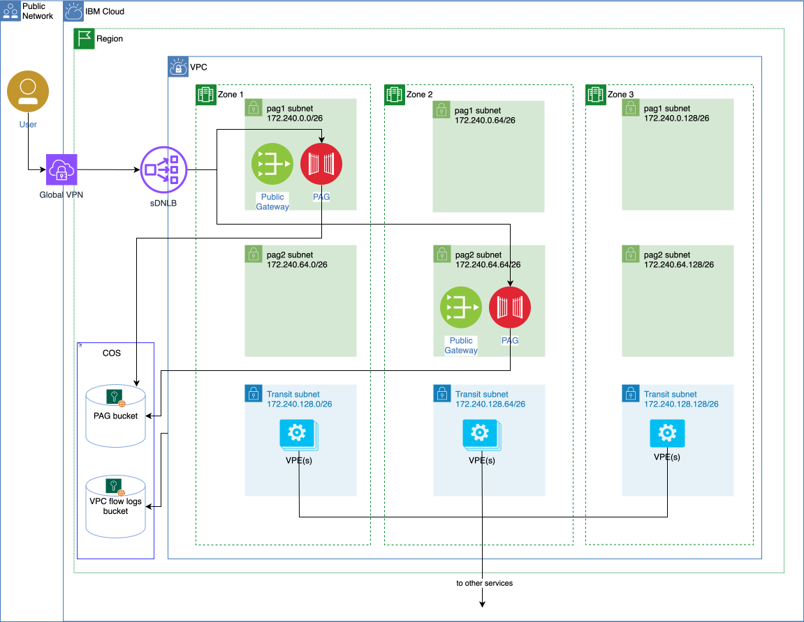

# Privileged Access Gateway
- [Privileged Access Gateway](#privileged-access-gateway)
  - [Developer onboarding](#developer-onboarding)
    - [Access to GPVPN and Yubikey](#access-to-gpvpn-and-yubikey)
    - [Access to Active directory](#access-to-active-directory)
    - [Access to IAM access groups](#access-to-iam-access-groups)
    - [Required software](#required-software)
  - [Service onboarding](#service-onboarding)
    - [Pre-requisites](#pre-requisites)
    - [Setup access controls](#setup-access-controls)
    - [Create Service IDs and credentials](#create-service-ids-and-credentials)
    - [Onboard to SDNLB](#onboard-to-sdnlb)
    - [Provision PAG Deployable Architecture](#provision-pag-deployable-architecture)
    - [Accessing Clusters](#accessing-clusters)
    - [Submit NetEngReq ticket](#submit-netengreq-ticket)
  - [Connecting to service clusters](#connecting-to-service-clusters)
  - [Troubleshooting and support](#troubleshooting-and-support)
  - [Onboarding requests](#onboarding-requests)
  - [Useful Documentations](#useful-documentations)

Privileged Access Gateway (PAG) is the managed service that replaces the custom Bastion solution.



## Developer onboarding
Service developers need to complete the following steps, or skip if not applicable.

### Access to GPVPN and Yubikey

- Register for a SoftLayer account ID [by submitting an IBM AccessHub request](https://ibm-support.saviyntcloud.com/ECMv6/request/applicationRequest?search=SWFhUyBBY2Nlc3MgTWFuYWdlbWVudA==) for new access to the IaaS Access Management application
- After your AccessHub request is approved, you receive an email that contains your account credentials
- Follow the instructions for [requesting a YubiKey](https://w3.ibm.com/w3publisher/ibm-cloud-yubikeys)

### Access to Active directory
The service has one active directory registered: `is-ng-ci`
Request access to the active directory through [AccessHub](https://ibm-support.saviyntcloud.com/ECMv6/request/applicationRequest?search=SWFhUyBBY2Nlc3MgTWFuYWdlbWVudA==)

### Access to IAM access groups
Request access to the `Privilege Access Gateway - Viewers` and `Kubernetes - Viewers` to view the PAG and Cluster instances.
### Required software
- [Install GPVPN client](https://am1.gp.softlayer.com/)
- Install the IBM Cloud CLI plug-in for PAG: `ibmcloud plugin install pag`


## Service onboarding
To add PAG to a region the next steps should be followed.

### Pre-requisites
Create a [VPC-CI-KeyProtect](https://cloud.ibm.com/keyprotect/crn%3Av1%3Abluemix%3Apublic%3Akms%3Aeu-gb%3Aa%2Fed2dc269480f4b2ebe9d6c90e01d9099%3A20151d8b-4c87-4583-bd57-fb57ce173dee%3A%3A) Key Protect instance in the same region being onboarded.

### Setup access controls
1. Add a `Privileged Access Gateway - Admins` IAM Access group with the following services and with the `manager` and `administrator` access policies
   - Key Protect for PAG
   - Privileged Access Gateway
2. Add a `Privileged Access Gateway - Viewers` IAM Access group with the following services and with the `writer` and `operator` access policies
   - Privileged Access Gateway

### Create Service IDs and credentials
1. For every account/region create a new Service ID in the account, `PAG Service ID` with the following access policies:
   1. `Viewer` for the resource group where PAG will be provisioned at, typically `Secrets Manager`
   2. `Manager`, `Editor` for `all` Cloud Object Storage
   3. `Reader`, `Editor` for `all` VPC Infrastructure
   4. `Manager`, `Editor` for `all` Privileged Access Gateway
   5. `Manager`, `Editor` for `Key Protect for PAG` instance of Key Protect
   6. `Viewer`, `Secrets Reader` for `VPC-CI-Universal-SecretsManagerr` instance of Secrets Manager
2. Create an IAM Credential secret (use Arbitrary secret until PAG adds IAM credentials support) `pag-apikey` for the Service ID in the `VPC-CI-Universal-SecretsManager` instance, under the `pag-credentials` secret group

### Onboard to SDNLB
- Create a ticket in [SDNLB Jira](https://jiracloud.swg.usma.ibm.com:8443/plugins/servlet/samlconsumer) or comment in #ibmcloud-service-dnlb
- Provide the Service ID’s IAM ID, the service name, service contact persons, service account ID, and the service environment (staging/production)

### Provision PAG Deployable Architecture
1. Request to [allowlist the account](https://github.ibm.com/GoldenEye/issues/issues/new?assignees=&labels=allowlist-request&template=DA_Allowlisting.md)
2. [Provision PAG using its Deployable Architecture (DA)](https://cloud.ibm.com/catalog/7df1e4ca-d54c-4fd0-82ce-3d13247308cd/architecture/deploy-arch-ibm-pag-internal-f39dc5f7-5f6e-4cb7-b457-ecf2af8d7863?catalog_query=aHR0cHM6Ly9jbG91ZC5pYm0uY29tL2NhdGFsb2c%2Fc2VhcmNoPXByaXZpbGVkZ2VkJTI1MjBhY2Nlc3MlMjUyMGdhdGV3YXkjc2VhcmNoX3Jlc3VsdHM%3D) from the Catalog
3. Configure the DA as follows:
    1. Project name: [pag-vpc-ci-onepipeline](https://cloud.ibm.com/projects/ab304093-0b41-4cd0-968d-7a0bbdc3c052)
    1. **Security tab**
       1. Authentication: `onepipelineci-cloud-api-key` secret from the `vpc-ci` secret group in the `VPC-CI-Universal-SecretsManager` instance
       2. Security and compliance: `Architecture default`
    2. **Required tab**
       1. region: **us-east**
       2. resource_prefix: **pag-vpc-oneplci**
       3. secret_manager_crn: **Instance CRN of the `VPC-CI-Universal-SecretsManager` instance where the following secret group and secret are in**
       4. secret_group_id: **group ID of `pag-credentials` secret group**
       5. sdnlb_api_key: **secret ID of `pag-apikey` secret**
       6. production_flag_enabled: **true for for a production region instance**
       7. sdnlb_endpoint_prefix: **vpc-oneplci-pag**
       8. existing_kms_instance_crn: **CRN of `VPC-CI-KeyProtect` service instance**
    3. **Optional tab**
       1. create_resource_group: **false**
       2. existing_resource_group_name: **Tekton_Workers**
   
### Accessing Clusters
Accessing clusters through the private cloud service endpoint. To create a private cloud service endpoint allowlist:
1. Get the subnets that you want to add to the allowlist - Get the Cloud Service Endpoint source addresses from the PAG VPC [pag-vpc-oneplci-vpc](https://cloud.ibm.com/infrastructure/network/vpc/us-east~r014-d19722ec-6d3c-4592-9b8d-b77227123c59/overview)
   
    | IP address	| Location |
    |  -------- | ------- |
    | 10.12.102.6	| Washington DC 1 |
    | 10.22.55.218	| Washington DC 2 |
    | 10.12.117.147	| Washington DC 3 |

2. Enable the subnet allowlist feature for a cluster's private cloud service endpoint. Now, access to the cluster via the private cloud service endpoint is blocked for any requests that originate from a subnet that is not in the allowlist. Your worker nodes continue to run and have access to the master.
    >ibmcloud ks cluster master private-service-endpoint allowlist enable --cluster <cluster_name_or_ID>
3. Add subnets from which authorized users can access your private cloud service endpoint to the allowlist.
    >ibmcloud ks cluster master private-service-endpoint allowlist add --cluster <cluster_name_or_ID> --subnet <subnet_CIDR> [--subnet <subnet_CIDR> ...]
    
    **Toronto Cluster:**
    ```
    ibmcloud ks cluster master private-service-endpoint allowlist add --cluster cianr93w0sjo00sko3k0 --subnet 10.12.102.6/32 --subnet 10.22.55.218/32 --subnet 10.12.117.147/32
    ```
    **London Cluster:**
    ```
    ibmcloud ks cluster master private-service-endpoint allowlist add --cluster cfurn1dl0diob85a3nl0 --subnet 10.12.102.6/32 --subnet 10.22.55.218/32 --subnet 10.12.117.147/32
    ```
4. Verify that the subnets in your allowlist are correct. The allowlist includes subnets that you manually added and subnets that are automatically added and managed by IBM, such as worker node subnets.
    >ibmcloud ks cluster master private-service-endpoint allowlist get --cluster <cluster_name_or_ID>


###  Submit NetEngReq ticket
1. While connected to GPVPN, create a [NetEngReq ticket](https://confluence.softlayer.local/display/NETGOVPUB/Requesting+Access+Permissions+for+GPVPN) - login using your Softlayer credentials
2. Use this template for the ticket:
>```
>Business Justification: Platform Operator access to PAG host
>Source IP: GP VPN Client
>AD Group: 
>Automatic or Manual initiation?: Manual
>How frequent is initiation?: Interactive/as needed
>Destination IP(s): N/A - Please use the 'destination hostname' below
>Destination Hostname(s):
>Destination Port(s): 7200, 7201, 7202, 7000
>Protocol: (TCP/UDP/ICMP): ALL
>Connection Security (IPSec VPN, SSL, Certificates, Secure File Transfer, etc.): SSL, SSH, Certs, HTTPS
>Data Direction (Incoming/Outgoing/Both): Both
>Will this impact customers (Yes/No): No
>Will any Customer Info (PII) be transmitted (Yes/No): No
>What types of Data will be traversing connection (Metrics, IPs, Usernames, etc. Be specific): All data associated with operator activities/actions
>Duration (Duration the rule is needed. Permanent, till MM/DD/YY, etc): Permanent
>Group/Service Team Contact for Rule Revalidation : lakshminarayana.bharadwaj.sattaru@ibm.com
>Change Category (This field is used to determine if a change is an emergency change or can be completed during normal business hours): Major
>Does/do the destination host(s) enforce 2FA/MFA?: No. It leverages IAM authentication which will have 2FA/MFA.
>Does/do the destination host(s) enforce session recording (i.e., Pylon/Teleport, or Centrify)?:  The target system is PAG which does enforce session recordings as part of the PAG product.
>Can changes to how the Cloud operates be made from the destination hosts(s)?: PAG is a Bastion solution, so users will be able to log into target systems via SSH and kubetctl/oc through the enabled PAG endpoint.
>```
- Update `AD Group` with `is-ng-ci`
- Update `Destination Hostname(s):` with the gateway address as decided when configuring the DA
- Ticket title: `Platform Operator access to PAG host`
- Request from the development manager and security focal to add their written approval as a comment in the submitted ticket

##  Connecting to service clusters
1. Login to GPVPN
2. From terminal:
    ```
    ibmcloud login --sso
    ibmcloud pag gateway set REGIONAL_GATEWAY
    ibmcloud pag ks config CLUSTER_NAME --ticket-id INC5868949
    ```
>```
>For staging, remove the --ticket-id flag.
>```
3. Run `kubectl` commands
   
## Troubleshooting and support
- Slack channel: #ibmcloud-pag
- To find out the health status of a PAG host down to the network level, [use the inspect script provided by PAG team](https://github.ibm.com/Privileged-Access/pag-support-scripts) and provide the results in #ibmcloud-pag

## Onboarding requests
* Onboard a service ID to SDNLB: [https://ibmcloudlab.slack.com/archives/C01C0MC0UPK/p1721282608009089](https://ibmcloudlab.slack.com/archives/C01C0MC0UPK/p1721282608009089)
* Add OnePipelineCloud account to the DA allowlist: [GoldenEye/issues#10088](https://github.ibm.com/GoldenEye/issues/issues/10088)
* PAG Instance: [pag-vpc-oneplci-pag
](https://cloud.ibm.com/services/privileged-access-gateway/crn%3Av1%3Abluemix%3Apublic%3Aprivileged-access-gateway%3Aus-east%3Aa%2Fed2dc269480f4b2ebe9d6c90e01d9099%3A36b46e69-17c5-4bb4-82f6-019e037c1918%3A%3A?paneId=infra)
* Requesting a New AD Group-object for PAG - [FABREQ-55225](https://jira.softlayer.local/browse/FABREQ-55225)
* Configure the Network Access Control List for Privileged Access Gateway - [NETENGREQ-19569](https://jira.softlayer.local/browse/NETENGREQ-19569)
  
## Useful Documentations
- [PAG Service Documentation](https://test.cloud.ibm.com/docs/privileged-access-gateway)
- [PAG Architecture](https://test.cloud.ibm.com/docs/privileged-access-gateway?topic=privileged-access-gateway-pag-sec044-architecture)
- [PAG Requirements](https://test.cloud.ibm.com/docs/privileged-access-gateway?topic=privileged-access-gateway-pag-requirements)
- [Accessing a Kubernetes cluster
](https://test.cloud.ibm.com/docs/privileged-access-gateway?topic=privileged-access-gateway-pag-using-pag-kubernetes)
- [Creating an allowlist for the private cloud service endpoint](https://cloud.ibm.com/docs/containers?topic=containers-access_cluster#private-se-allowlist)