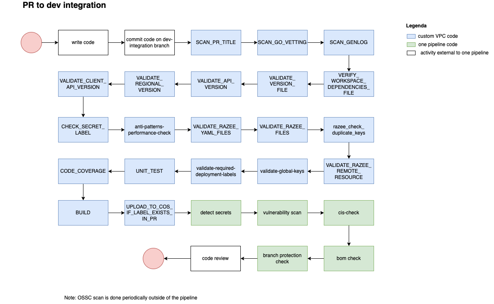
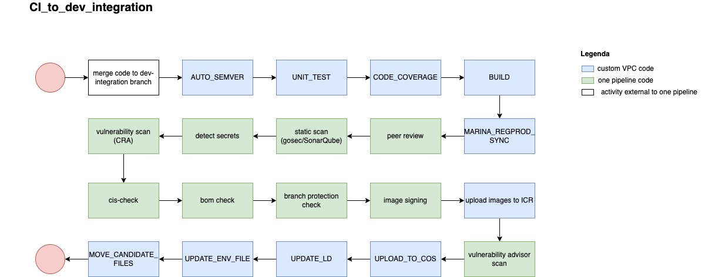
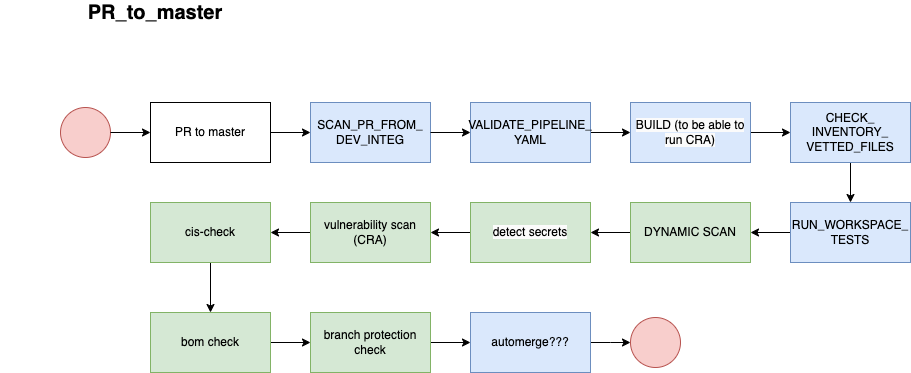
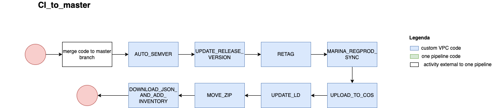

# Development Process

VPC uses two main branches for its CI process: dev-integration and master/main.

Artifacts are build only on dev-integration. The master branch is used to perform legacy bureaucratic activities.

To support this process, the standard pipeline model offered by one pipeline had to be split into 4 pipelines instead of the
traditional two ones:

- PR to dev-integration
- CI to dev-integration
- PR to master
- CI to master

These four pipelines map on the ARCH011 sections [Code](https://github.ibm.com/ibmcloud/governed-content/blob/main/architecture/devops/sub_pages/code.md) 
[Build] and (https://github.ibm.com/ibmcloud/governed-content/blob/main/architecture/devops/sub_pages/build.md).

The population of the compliance inventory repo is done in CI to master to be sure not to mark as "promotable" artifacts that did not pass all scans
and tests.

Notes:
- OSSC scan is done periodically, outside of the 4 pipelines mentioned above

## PR to dev-integration

This pipeline runs on our private worker but, in case of emergency/running short of resources, can run also on public workers.

## CI to dev-integration

This pipeline requires both private workers and TaaS workers: TaaS workers are needed for the signing step; private workers are needed
because of their special connectivity to the deployers in qz2. In case of emergency/running short of resources, the RIAS workspaces
can use public workers instead of private ones.

## PR to master

This pipeline requires both private workers and TaaS workers: TaaS workers because the test framework currently requires connectivity 
to the IBM internal network. In case of emergency/running short of resources, it can run also on public workers instead of private ones.

## CI to master

This pipeline requires TaaS workers because it needs to connect to VPC Jira that is on the IBM internal network.

Once the code is merged on master it is suitable to start its journey across pre-integration, integration, staging and production environments.
